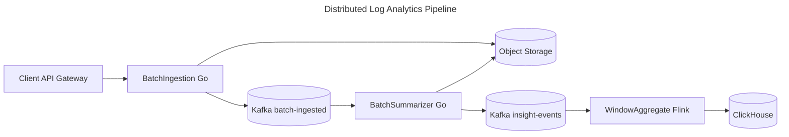
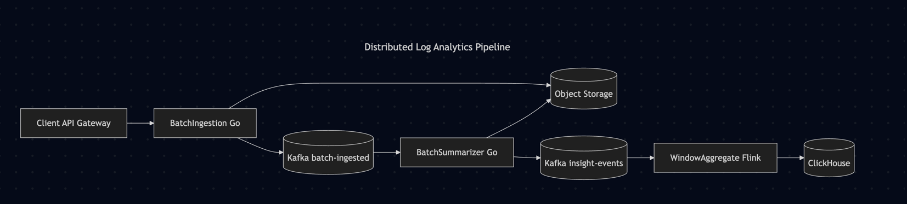

# Log Analytics Pipeline


## Description

This log analytics pipeline ingests log batches via HTTP, summarizes them into time-windowed aggregates, and stores the results for analysis. All components run locally in a single process. The solution is designed for both performance and correctness: it uses partitioned queues and worker goroutines to achieve parallelism across different time windows, while ensuring race condition prevention through partition-based single-writer guarantees and duplicate batch detection through atomic file operations that simulate S3-like behavior.

## Assumptions

**Log Entry Properties:**
- Log entries are not duplicated across or within batches

**Batch Properties:**
- **MaxBatchBytes**: <= 2 MB
- **Batch format**: JSON array of log entries
- **Entry ordering**: Not guaranteed within a batch
- **Time purity**: Batches may include logs across multiple minutes; windowing happens during aggregation
- **Delivery**: At-least-once (retries may cause duplicate batches)

**Aggregation Rules:**
- Groups by minute based on `receivedAt` timestamp
- User agent is normalized to family (e.g., "Chrome", "Firefox", "Googlebot")
- Path is normalized as `METHOD + " " + path` (e.g., "GET /", "POST /api/users")

**Authentication:**
- API gateway performs authentication and forwards `x-customer-id` header to the app


## How to run the project

### Prerequisites
- **Go 1.24** (required for direct execution)
- **Docker & Docker Compose** (optional, for containerized execution)

### Direct Execution with VSCode

- **Run Main** - Run the application
- **Run Main (Live Reload)** - Run with live reload using `air` (default build task)
- **Test (No Cache)** - Run unit tests without cache (default test task)
- **Run E2E Scenario (001_basic_minute_rollup)** - Run the e2e simulation


### Sample curls

Once the server is up, these curls can be executed to verify
**1. POST logs (ingest log batch):**
```bash
curl -X POST http://localhost:8080/logs \
  -H "Content-Type: application/json" \
  -H "x-customer-id: cus-axon" \
  -H "idempotency-key: batch-XXX" \
  -d '[
    {
      "receivedAt": "2025-12-28T18:03:15.000Z",
      "method": "GET",
      "path": "/",
      "userAgent": "Mozilla/5.0 (Windows NT 10.0; Win64; x64) AppleWebKit/537.36"
    },
    {
      "receivedAt": "2025-12-28T18:03:16.000Z",
      "method": "GET",
      "path": "/about",
      "userAgent": "Mozilla/5.0 (X11; Linux x86_64; rv:121.0) Gecko/20100101 Firefox/121.0"
    }
  ]'
```

**2. GET metrics (Prometheus metrics):**
```bash
curl http://localhost:8080/metrics
```


### Alternative - Direct Execution with Go commands

```bash
# 1. Download dependencies
go mod download

# 2. Run the application
go run ./cmd/server/main.go

# 3. Run unit tests
go test -v ./...
```

### Alternative - Docker Execution

```bash
# 1. Build and start the service
docker-compose up -d

# 2. View logs
docker-compose logs -f

# 3. Stop the service
docker-compose down
```

## E2E simulation explained


## How the code is structured

- **main** (`cmd/server/main.go`): Application entry point that loads configuration and starts the app.
- **internal/app**: Application initialization, dependency injection, and lifecycle management.
- **internal/aggregators**: Aggregates partial insights into final window aggregate results using rollup operations.
- **internal/ingestors**: Ingests log batches, summarizes them into time windows, and produces partial insight events.
- **internal/stores**: Storage layer providing file-based persistence for log batches and aggregate results.
- **internal/http**: HTTP handlers, middleware, routing, and request/response handling.
- **internal/streams**: Stream processing with partitioned queues for distributing and consuming partial insight events.
- **internal/models**: Domain models and data structures (log batches, summaries, aggregates, window sizes).
- **internal/shared**: Shared utilities including configuration loading, logging, metrics, file storage, and error handling.

## Production Improvements

This solution runs locally using file storage and in-process queues to keep the assignment small. In production, I would extend the same design into a distributed pipeline by replacing local components and separating ingestion, summarization, and aggregation into independent services.




### Services
- **BatchIngestion (Go)**  
  Handles HTTP ingestion, validates requests, writes raw log batches to object storage (S3/GCS), and emits ingestion events.

- **BatchSummarizer (Go)**  
  Consumes ingestion events, reads raw batches from object storage, normalizes logs, generates time-windowed partial insights, and emits insight events.

- **WindowAggregate (Flink)**  
  Consumes insight events and performs event-time windowed aggregation with deduplication and watermarks, producing finalized aggregates.

### Distributed Architecture
- **File store → Object store (S3/GCS)** for raw batches and intermediate summaries
- **In-process queues → Kafka** for durable, partitioned event streams
- **Worker goroutines → Flink** for scalable stateful aggregation
- **Local aggregates → ClickHouse** for analytical queries and rollups

### Event & Data Flow
1. **BatchIngestion** writes raw batches to S3 and emits `batch-ingested` events (partitioned by `batchId`).
2. **BatchSummarizer** reads batches from S3, generates per-window partial insights, and emits insight events.
    - **Kafka partition key:** `customerId + bucketKey`
        - Example: `cus-axon | minute-01`
3. **WindowAggregate (Flink)** aggregates insights using event-time processing and emits finalized window aggregates.
4. **ClickHouse** ingests window aggregates and derives higher-level rollups (hour/day).

### Late Events & Correctness
I’m aware that late-arriving events are common in distributed systems and can be caused by retries, network delays, backpressure, or downstream failures. I don’t have a complete solution for this problem yet, and this design does not attempt to fully address it. My current thinking is that late events should be routed to a separate queue and handled through a dedicated backfill or reconciliation flow, which is outside the scope of this implementation.

## AI Tools
- **ChatGPT**: Used for brainstorming solutions and writing documentation
- **Cursor**: Used for writing implementation and tests